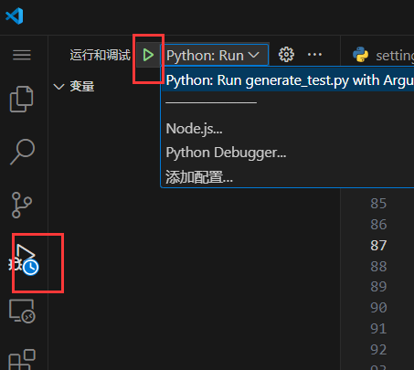

## 1,debug步骤

### 1,launch的配置
```js 
{
    // 使用 IntelliSense 了解相关属性。 
    // 悬停以查看现有属性的描述。
    // 欲了解更多信息，请访问: https://go.microsoft.com/fwlink/?linkid=830387
    "version": "0.2.0",
    "configurations": [
        {
            "name": "Python: Run generate_test.py with Arguments",
            "type": "debugpy",
            "request": "launch",
            "program": "${workspaceFolder}/generate_test.py", // 替换成你的文件路径
            "args": ["RADAR", "PredatorPrey-8", "0.5"], // 添加脚本参数
            "console": "integratedTerminal"
        }
    ]
}
```


### 2，运行


